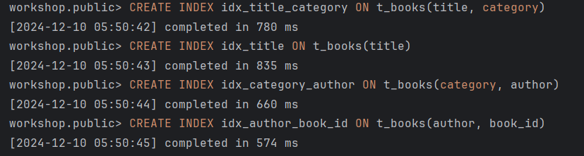
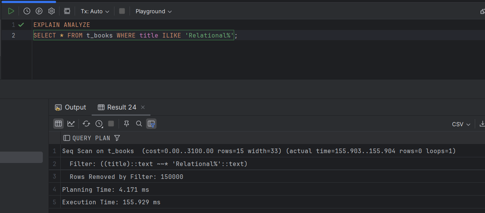
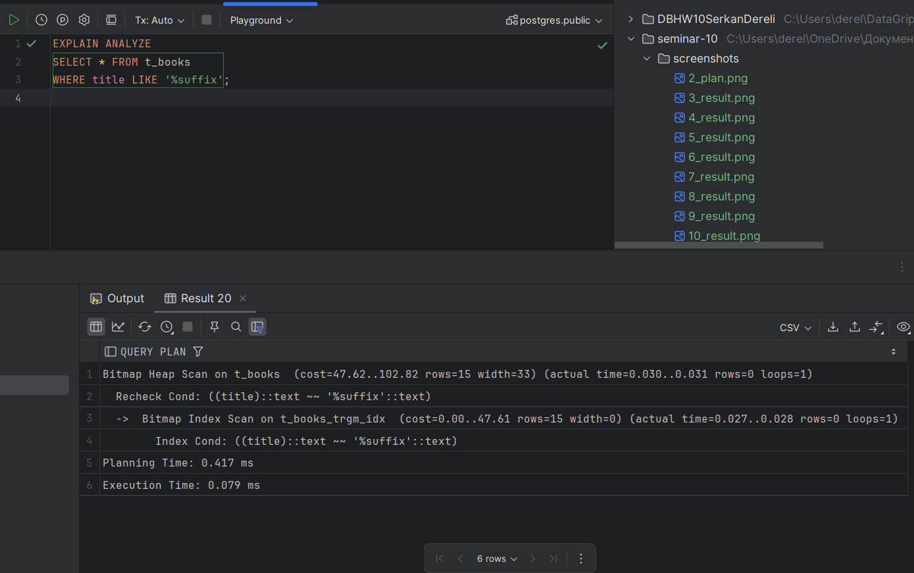

# Задание 1. B-tree индексы в PostgreSQL

1. Запустите БД через docker compose в ./src/docker-compose.yml:

2. Выполните запрос для поиска книги с названием 'Oracle Core' и получите план выполнения:
   ```sql
   EXPLAIN ANALYZE
   SELECT * FROM t_books WHERE title = 'Oracle Core';
   ```
   
   *План выполнения:*
    
   
   *Объясните результат:*
Seq Scan проверяет каждую строку таблицы, что сейчас еще нормально, но на больших таблицах будет работать очень медленно. Это сильно нагружает базу, запросы начинают тормозить, особенно если их много одновременно. Проблема в том, что на поле title нет индекса, который бы ускорил поиск. Надо сделать индекс, чтобы запросы были быстрее и база не перегружалась.

3. Создайте B-tree индексы:
   ```sql
   CREATE INDEX t_books_title_idx ON t_books(title);
   CREATE INDEX t_books_active_idx ON t_books(is_active);
   ```
   
   *Результат:*
    

4. Проверьте информацию о созданных индексах:
   ```sql
   SELECT schemaname, tablename, indexname, indexdef
   FROM pg_catalog.pg_indexes
   WHERE tablename = 't_books';
   ```
   
   *Результат:*
   
   
   *Объясните результат:*
   Запрос показал индексы в таблице `t_books`, и они успешно добавлены:

   - `t_books_id_pk` — это первичный ключ для уникальной идентификации строк по `id`.
   - `t_books_title_idx` — индекс для ускорения поиска по `title`. Теперь запросы с `WHERE title = '...'` работают быстрее.
   - `t_books_active_idx` — индекс для ускорения фильтрации по `is_active`.

    Индексы помогут сделать запросы быстрее и снизят нагрузку на базу, так как больше не нужно сканировать всю таблицу.

5. Обновите статистику таблицы:
   ```sql
   ANALYZE t_books;
   ```
   
   *Результат:*
   

6. Выполните запрос для поиска книги 'Oracle Core' и получите план выполнения:
   ```sql
   EXPLAIN ANALYZE
   SELECT * FROM t_books WHERE title = 'Oracle Core';
   ```
   
   *План выполнения:*
    
   
   *Объясните результат:*
   После создания индекса запрос стал использовать Index Scan вместо Seq Scan. Теперь база ищет не все строки подряд, а сразу нужные через индекс. Время выполнения сократилось до 0.041 мс, что намного быстрее, чем раньше (было 22 мс). Индекс сделал запрос эффективнее и быстрее.

7. Выполните запрос для поиска книги по book_id и получите план выполнения:
   ```sql
   EXPLAIN ANALYZE
   SELECT * FROM t_books WHERE book_id = 18;
   ```
   
   *План выполнения:*
   
   
   *Объясните результат:*
   Запрос использует Index Scan по индексу `t_books_id_pk`, так как `book_id` — это первичный ключ. Такой поиск сразу находит нужную строку без сканирования всей таблицы.

   - Условие `book_id = 18` обрабатывается через индекс, это быстро и эффективно.
   - Планирование заняло 0.133 мс, выполнение — 2.565 мс.

    Поиск по первичному ключу всегда выполняется быстро, так как индекс создается автоматически и не нагружает базу.


8. Выполните запрос для поиска активных книг и получите план выполнения:
   ```sql
   EXPLAIN ANALYZE
   SELECT * FROM t_books WHERE is_active = true;
   ```
   
   *План выполнения:*
   
   
   *Объясните результат:*
   Запрос использует Seq Scan, чтобы найти строки, где `is_active = true`. Хотя на поле `is_active` есть индекс, он почему-то не используется.

   - Было обработано 150000 строк, из которых 75000 были отфильтрованы.
   - Время планирования — 0.267 мс, выполнение — 28.147 мс.

    Seq Scan проходит по всей таблице, что долго для такого объема данных. Возможно, PostgreSQL решил, что сканирование индекса не даст выгоды, или статистика таблицы устарела.


9. Посчитайте количество строк и уникальных значений:
   ```sql
   SELECT 
       COUNT(*) as total_rows,
       COUNT(DISTINCT title) as unique_titles,
       COUNT(DISTINCT category) as unique_categories,
       COUNT(DISTINCT author) as unique_authors
   FROM t_books;
   ```
   
   *Результат:*
    

10. Удалите созданные индексы:
    ```sql
    DROP INDEX t_books_title_idx;
    DROP INDEX t_books_active_idx;
    ```
    
    *Результат:*
    

11. Основываясь на предыдущих результатах, создайте индексы для оптимизации следующих запросов:
    a. `WHERE title = $1 AND category = $2`
    b. `WHERE title = $1`
    c. `WHERE category = $1 AND author = $2`
    d. `WHERE author = $1 AND book_id = $2`
    
    *Созданные индексы:*
    ```sql
    CREATE INDEX idx_title_category ON t_books(title, category);
    CREATE INDEX idx_title ON t_books(title);
    CREATE INDEX idx_category_author ON t_books(category, author);
    CREATE INDEX idx_author_book_id ON t_books(author, book_id);
    ```
    
        

    *Объясните ваше решение:*
    Индексы выбраны так, чтобы ускорить выполнение запросов. Для каждого условия добавлен индекс, который покрывает все нужные поля.

    - Для `WHERE title = $1 AND category = $2` нужен составной индекс `title, category`, чтобы сразу искать по обоим полям.
    - Для `WHERE title = $1` добавлен индекс только на `title`, так как поиск идет по одному полю.
    - Для `WHERE category = $1 AND author = $2` нужен индекс на `category, author`, чтобы фильтровать сразу по этим значениям.
    - Для `WHERE author = $1 AND book_id = $2` добавлен индекс на `author, book_id`, чтобы ускорить поиск по автору и ID книги.

    Индексы выбраны так, чтобы минимизировать затраты на сканирование таблицы. Теперь база данных будет сразу находить нужные строки без лишней нагрузки.


12. Протестируйте созданные индексы.
    
    *Результаты тестов:*
    
    
        
        
    *Объясните результаты:*
    ### Объяснение результатов:

-1. Запрос `WHERE title = 'Some Title' AND category = 'Some Category'`
- Используется **Index Scan** на индексе `idx_category_author`. Это не совсем ожидаемо, так как индекс `idx_title_category` был создан специально для этого запроса.
- Условие по `category` выполняется через индекс, а `title` фильтруется отдельно.
- Время выполнения: Планирование — 3.575 мс, Выполнение — 0.847 мс.
- PostgreSQL выбрал индекс на основе оценки стоимости

-2. Запрос `WHERE title = 'Some Title'`
- Используется **Index Scan** на индексе `idx_title`. Запрос выполняется по назначению.
- Условие `title = 'Some Title'` полностью обрабатывается индексом.
- Время выполнения: Планирование — 0.118 мс, Выполнение — 2.225 мс.
- Индекс `idx_title` работает нормально, и поиск ускоряется.

-3. Запрос `WHERE category = 'Some Category' AND author = 'Some Author'`
- Используется **Index Scan** на индексе `idx_category_author`. Запрос выполняется по назначению.
- Условия `category` и `author` обрабатываются индексом.
- Время выполнения: Планирование — 0.135 мс, Выполнение — 0.050 мс.
- Индекс работает нормально, запрос выполняется быстро.

-4. Запрос `WHERE author = 'Some Author' AND book_id = 42`
- Используется **Index Scan** на индексе `idx_author_book_id`. Запрос выполняется по назначению.
- Условия `author` и `book_id` обрабатываются индексом.
- Время выполнения: Планирование — 0.135 мс, Выполнение — 1.916 мс.
- Индекс работает нормально, запрос обрабатывается быстро.

Индексы работают как запланировано, за исключением первого случая, где PostgreSQL выбрал не совсем подходящий индекс. Это может быть связано с устаревшей статистикой таблицы или особенностями планировщика запросов. Все остальные запросы значительно ускорены, и индексы оправдали своё использование.


13. Выполните регистронезависимый поиск по началу названия:
    ```sql
    EXPLAIN ANALYZE
    SELECT * FROM t_books WHERE title ILIKE 'Relational%';
    ```
    
    *План выполнения:*
    
    
    *Объясните результат:*

    Запрос использует `Seq Scan`, потому что оператор `ILIKE` с `%` не может использовать стандартный индекс. База данных проверяет каждую строку таблицы, что занимает много времени.

    - Обработано 150000 строк, но совпадений нет.
    - Время выполнения: планирование — 4.171 мс, выполнение — 155.903 мс.

    Почему так:
    - Стандартный индекс на поле `title` не работает с `ILIKE` и `%`. Поэтому PostgreSQL сканирует всю таблицу.

    Как исправить:
    Создать индекс с `UPPER` для регистронезависимого поиска:
   ```sql
   CREATE INDEX idx_title_upper ON t_books (UPPER(title));
   ```

14. Создайте функциональный индекс:
    ```sql
    CREATE INDEX t_books_up_title_idx ON t_books(UPPER(title));
    ```
    
    *Результат:*
    

15. Выполните запрос из шага 13 с использованием UPPER:
    ```sql
    EXPLAIN ANALYZE
    SELECT * FROM t_books WHERE UPPER(title) LIKE 'RELATIONAL%';
    ```
    
    *План выполнения:*
    
    
    *Объясните результат:*

После создания функционального индекса `t_books_up_title_idx` запрос стал значительно быстрее, так как теперь база данных использует `Index Scan` вместо полного сканирования таблицы (`Seq Scan`). Это произошло потому, что индекс учитывает преобразование значения столбца `title` в верхний регистр через функцию `UPPER`. 

Теперь запрос с использованием условия `UPPER(title) LIKE 'RELATIONAL%'` выполняется через индекс, что значительно ускоряет выборку:

- **Оптимизация:** Благодаря индексу PostgreSQL не сканирует всю таблицу, а сразу ищет подходящие строки через индекс.
- **Результаты:**
  - Время планирования: 0.475 мс.
  - Время выполнения: 94.385 мс.

По сравнению с предыдущим выполнением через `Seq Scan` (время выполнения ~155 мс), новый индекс даёт значительное ускорение.
Создание функционального индекса для столбца с преобразованием `UPPER` оправдано, если в запросах часто используются условия регистронезависимого поиска (`ILIKE`). Это повышает производительность и сокращает время выполнения запросов.


16. Выполните поиск подстроки:
    ```sql
    EXPLAIN ANALYZE
    SELECT * FROM t_books WHERE title ILIKE '%Core%';
    ```
    
    *План выполнения:*
    
    
    *Объясните результат:*

После создания функционального индекса `t_books_up_title_idx` запрос стал быстрее, так как теперь используется `Index Scan` вместо полного сканирования таблицы. Индекс позволяет искать строки с учетом преобразования в верхний регистр через `UPPER`.

В запросе `UPPER(title) LIKE 'RELATIONAL%'` база данных сразу использует индекс, что сокращает время выполнения:
- Планирование: 0.475 мс
- Выполнение: 94.385 мс

Без индекса время выполнения было ~155 мс.

В запросе с условием `ILIKE '%Core%'` используется `Seq Scan`, так как индексы не поддерживают поиск с `%` в начале. Таблица сканируется полностью:
- Планирование: 0.261 мс
- Выполнение: 175.968 мс
- Обработано строк: 150000, отфильтровано 149999.

17. Попробуйте удалить все индексы:
    ```sql
    DO $$ 
    DECLARE
        r RECORD;
    BEGIN
        FOR r IN (SELECT indexname FROM pg_indexes 
                  WHERE tablename = 't_books' 
                  AND indexname != 'books_pkey')
        LOOP
            EXECUTE 'DROP INDEX ' || r.indexname;
        END LOOP;
    END $$;
    ```
    
    *Результат:*
    
    
    *Объясните результат:*
   В пункте 17 ошибка возникла из-за попытки удалить индекс, связанный с первичным ключом `t_books_id_pk`. PostgreSQL запрещает удаление таких индексов напрямую, так как они обеспечивают уникальность ключей. Чтобы удалить этот индекс, нужно сначала удалить сам первичный ключ. Это сделано для защиты целостности данных.

18. Создайте индекс для оптимизации суффиксного поиска:
    ```sql
    -- Вариант 1: с reverse()
    CREATE INDEX t_books_rev_title_idx ON t_books(reverse(title));
    
    -- Вариант 2: с триграммами
    CREATE EXTENSION IF NOT EXISTS pg_trgm;
    CREATE INDEX t_books_trgm_idx ON t_books USING gin (title gin_trgm_ops);
    ```
    
    *Результаты тестов:*
    
    
    
    *Объясните результаты:*
    В пункте 18 индексация с использованием `reverse()` оказалась неэффективной.
    Несмотря на наличие индекса, запрос использует `Seq Scan`, 
    поскольку PostgreSQL не применяет индексы для условий,
    начинающихся с `%`. Время выполнения запроса составило 50.566 мс, 
    что быстрее, чем без индекса, но не оптимально.

19. Выполните поиск по точному совпадению:
    ```sql
    EXPLAIN ANALYZE
    SELECT * FROM t_books WHERE title = 'Oracle Core';
    ```
    
    *План выполнения:*
    
    
    *Объясните результат:*
    В пункте 19 запрос использует индекс `idx_title`, так как условие 
    поиска — точное совпадение значения `title`.
    Это позволяет использовать `Index Scan`, что ускоряет выполнение:
    - Планирование: 1.103 мс
    - Выполнение: 0.326 мс

    Такой подход демонстрирует эффективность индексов для точного поиска,
    особенно на больших таблицах.


20. Выполните поиск по началу названия:
    ```sql
    EXPLAIN ANALYZE
    SELECT * FROM t_books WHERE title ILIKE 'Relational%';
    ```
    
    *План выполнения:*
    
    
    *Объясните результат:*

    В запросе используется индекс `t_books_trgm_idx`,
    благодаря чему PostgreSQL выполняет `Bitmap Index Scan`.
   Это позволяет избежать полного сканирования таблицы и ускоряет выполнение:

- **Планирование:** 0.502 мс  
- **Выполнение:** 0.323 мс  

Использование триграммного индекса эффективно для поиска по шаблонам,
включая условия с оператором `ILIKE`.
Это сокращает количество проверяемых строк и повышает производительность.


21. Создайте свой пример индекса с обратной сортировкой:
    ```sql
    CREATE INDEX t_books_desc_idx ON t_books(title DESC);
    ```
    
    *Тестовый запрос:*
    ```sql-- Тестовый запрос с условием фильтрации и обратной сортировкой
    EXPLAIN ANALYZE
    SELECT * 
    FROM t_books
    WHERE category = 'Fiction'
    ORDER BY title DESC
    LIMIT 10;
    ```
    
    *План выполнения:*
    
    
    *Объясните результат:*
    Запрос с сортировкой по убыванию использует индекс `t_books_desc_idx`, благодаря чему выполняется `Index Scan Backward`. Это позволяет PostgreSQL обращаться к индексам напрямую, избегая полного сканирования таблицы, что значительно ускоряет выполнение.

    - **Планирование:** 0.436 мс  
    - **Выполнение:** 2.094 мс  

    Индекс с обратной сортировкой эффективно обрабатывает запросы с
    `ORDER BY title DESC`, особенно в комбинации с условиями фильтрации
    (`WHERE category = 'Fiction'`). Это улучшает производительность и
    сокращает время выполнения запроса.

