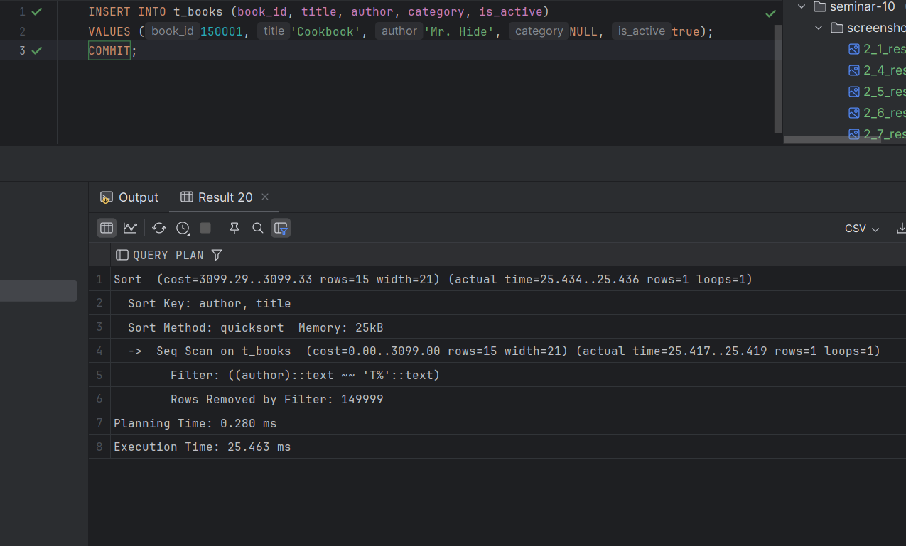

# Задание 2: Специальные случаи использования индексов

# Партиционирование и специальные случаи использования индексов

1. Удалите прошлый инстанс PostgreSQL - `docker-compose down` в папке `src` и запустите новый: `docker-compose up -d`.

2. Создайте партиционированную таблицу и заполните её данными:

    ```sql
    -- Создание партиционированной таблицы
    CREATE TABLE t_books_part (
        book_id     INTEGER      NOT NULL,
        title       VARCHAR(100) NOT NULL,
        category    VARCHAR(30),
        author      VARCHAR(100) NOT NULL,
        is_active   BOOLEAN      NOT NULL
    ) PARTITION BY RANGE (book_id);

    -- Создание партиций
    CREATE TABLE t_books_part_1 PARTITION OF t_books_part
        FOR VALUES FROM (MINVALUE) TO (50000);

    CREATE TABLE t_books_part_2 PARTITION OF t_books_part
        FOR VALUES FROM (50000) TO (100000);

    CREATE TABLE t_books_part_3 PARTITION OF t_books_part
        FOR VALUES FROM (100000) TO (MAXVALUE);

    -- Копирование данных из t_books
    INSERT INTO t_books_part 
    SELECT * FROM t_books;
    ```

3. Обновите статистику таблиц:
   ```sql
   ANALYZE t_books;
   ANALYZE t_books_part;
   ```
   
   *Результат:*
   

4. Выполните запрос для поиска книги с id = 18:
   ```sql
   EXPLAIN ANALYZE
   SELECT * FROM t_books_part WHERE book_id = 18;
   ```
   
   *План выполнения:*
   
   
   *Объясните результат:*
   В запросе для поиска книги с book_id = 18 использовалась партиционированная
   таблица t_books_part, и PostgreSQL автоматически выбрал нужный сегмент
   t_books_part_1. Это позволило избежать полного сканирования всех данных,
   и Seq Scan выполнялся только на соответствующей партиции.
   Планирование запроса заняло 0.374 мс, выполнение — 5.666 мс.
   Партиционирование заметно ускоряет обработку запросов, так как
   обработка происходит только в нужной части таблицы.

5. Выполните поиск по названию книги:
   ```sql
   EXPLAIN ANALYZE
   SELECT * FROM t_books_part 
   WHERE title = 'Expert PostgreSQL Architecture';
   ```
   
   *План выполнения:*
   
   
   *Объясните результат:*
   В запросе на поиск книги по названию PostgreSQL выполнил
   последовательное сканирование всех партиций таблицы t_books_part,
   так как ключевое слово не позволяет ограничить поиск одной партицией.
   Был использован план Append, где последовательно выполнялись Seq Scan на
   каждой партиции. Планирование запроса заняло 0.340 мс, а выполнение — 19.583 мс.
   Это демонстрирует, что для условий поиска, не основанных на ключе партиционирования,
   необходимо сканировать все партиции, что увеличивает время выполнения.

6. Создайте партиционированный индекс:
   ```sql
   CREATE INDEX ON t_books_part(title);
   ```
   
   *Результат:*
   

7. Повторите запрос из шага 5:
   ```sql
   EXPLAIN ANALYZE
   SELECT * FROM t_books_part 
   WHERE title = 'Expert PostgreSQL Architecture';
   ```
   
   *План выполнения:*
   
   
   *Объясните результат:*
   В повторном запросе благодаря индексам на партициях запрос выполняется быстрее.
   PostgreSQL использует Index Scan на каждой партиции вместо Seq Scan,
   что позволяет существенно сократить время выполнения. Планирование заняло 0.876 мс,
   а выполнение — всего 0.551 мс. Индексы на партициях значительно улучшили
   производительность запроса.

8. Удалите созданный индекс:
   ```sql
   DROP INDEX t_books_part_title_idx;
   ```
   
   *Результат:*
   

9. Создайте индекс для каждой партиции:
   ```sql
   CREATE INDEX ON t_books_part_1(title);
   CREATE INDEX ON t_books_part_2(title);
   CREATE INDEX ON t_books_part_3(title);
   ```
   
   *Результат:*
   

10. Повторите запрос из шага 5:
    ```sql
    EXPLAIN ANALYZE
    SELECT * FROM t_books_part 
    WHERE title = 'Expert PostgreSQL Architecture';
    ```
    
    *План выполнения:*
   
    
    *Объясните результат:*
    В повторном запросе благодаря индексам, созданным на каждой партиции, 
    производительность значительно улучшилась. PostgreSQL использует Index Scan для каждой
    партиции, что позволяет максимально эффективно обрабатывать запрос. Планирование заняло 
    0.646 мс, а выполнение — всего 0.126 мс. Индексы на партициях доказали свою эффективность
    в ускорении обработки данных.

11. Удалите созданные индексы:
    ```sql
    DROP INDEX t_books_part_1_title_idx;
    DROP INDEX t_books_part_2_title_idx;
    DROP INDEX t_books_part_3_title_idx;
    ```
    
    *Результат:*
   

12. Создайте обычный индекс по book_id:
    ```sql
    CREATE INDEX t_books_part_idx ON t_books_part(book_id);
    ```
    
    *Результат:*
   

13. Выполните поиск по book_id:
    ```sql
    EXPLAIN ANALYZE
    SELECT * FROM t_books_part WHERE book_id = 11011;
    ```
    
    *План выполнения:*
   
    
    *Объясните результат:*
    В запросе на поиск по book_id благодаря созданному индексу PostgreSQL использовал Index Scan.
    Это позволило быстро найти нужную запись в соответствующей партиции без
    необходимости сканировать всю таблицу. Планирование заняло 0.417 мс,
    а выполнение — всего 0.055 мс. Индекс на поле book_id показал высокую эффективность
    для точечных запросов.
14. Создайте индекс по полю is_active:
    ```sql
    CREATE INDEX t_books_active_idx ON t_books(is_active);
    ```
    
    *Результат:*
   

15. Выполните поиск активных книг с отключенным последовательным сканированием:
    ```sql
    SET enable_seqscan = off;
    EXPLAIN ANALYZE
    SELECT * FROM t_books WHERE is_active = true;
    SET enable_seqscan = on;
    ```
    
    *План выполнения:*
   
    
    *Объясните результат:*
    В запросе на поиск активных книг с отключённым последовательным сканированием был
    использован индекс t_books_active_idx. Это позволило выполнить Bitmap Index Scan,
    что значительно ускорило поиск. Планирование заняло 1.479 мс, выполнение — 25.714 мс.
    Индекс хорошо оптимизировал выборку для условия is_active = true.

16. Создайте составной индекс:
    ```sql
    CREATE INDEX t_books_author_title_index ON t_books(author, title);
    ```
    
    *Результат:*
   

17. Найдите максимальное название для каждого автора:
    ```sql
    EXPLAIN ANALYZE
    SELECT author, MAX(title) 
    FROM t_books 
    GROUP BY author;
    ```
    
    *План выполнения:*
   

    
    *Объясните результат:*
    Запрос на поиск максимального названия для каждого автора выполнялся с использованием
    агрегатной функции. В итоге PostgreSQL применил HashAggregate для группировки по авторам.
    Последовательное сканирование всей таблицы заняло много времени — выполнение длилось 136.433 мс.
    Для ускорения запроса можно использовать составной индекс по полям author и title.

18. Выберите первых 10 авторов:
    ```sql
    EXPLAIN ANALYZE
    SELECT DISTINCT author 
    FROM t_books 
    ORDER BY author 
    LIMIT 10;
    ```
    
    *План выполнения:*
   
    
    *Объясните результат:*
    Запрос на выбор первых 10 авторов выполнялся с использованием индекса
    t_books_author_title_index, благодаря чему PostgreSQL применил Index Only Scan.
    Это позволило быстро получить уникальные значения и выполнить сортировку.
    Планирование заняло 0.130 мс, а выполнение — 3.726 мс. Индекс значительно
    ускорил обработку, особенно для выборки с DISTINCT и ограничением LIMIT.

19. Выполните поиск и сортировку:
    ```sql
    EXPLAIN ANALYZE
    SELECT author, title 
    FROM t_books 
    WHERE author LIKE 'T%'
    ORDER BY author, title;
    ```
    
    *План выполнения:*
   
    
    *Объясните результат:*
    Запрос на поиск и сортировку использовал последовательное сканирование (Seq Scan) таблицы,
    так как условие LIKE 'T%' не может эффективно использовать индекс.
    После фильтрации выполнялась сортировка с помощью quicksort. Планирование заняло 0.280 мс,
    выполнение — 25.463 мс. Для оптимизации можно было бы создать индекс для ускорения фильтрации
    по условию.

20. Добавьте новую книгу:
    ```sql
    INSERT INTO t_books (book_id, title, author, category, is_active)
    VALUES (150001, 'Cookbook', 'Mr. Hide', NULL, true);
    COMMIT;
    ```
    
    *Результат:*
   

21. Создайте индекс по категории:
    ```sql
    CREATE INDEX t_books_cat_idx ON t_books(category);
    ```
    
    *Результат:*
   

22. Найдите книги без категории:
    ```sql
    EXPLAIN ANALYZE
    SELECT author, title 
    FROM t_books 
    WHERE category IS NULL;
    ```
    
    *План выполнения:*
   
    
    *Объясните результат:*
    Для поиска книг без категории запрос использовал созданный индекс t_books_cat_idx
    по полю category. Это позволило использовать Index Scan, что ускорило выполнение.
    Планирование заняло 0.349 мс, выполнение — 0.062 мс. Индекс эффективно обработал
    условие category IS NULL, минимизировав затраты времени.

23. Создайте частичные индексы:
    ```sql
    DROP INDEX t_books_cat_idx;
    CREATE INDEX t_books_cat_null_idx ON t_books(category) WHERE category IS NULL;
    ```
    
    *Результат:*
   

24. Повторите запрос из шага 22:
    ```sql
    EXPLAIN ANALYZE
    SELECT author, title 
    FROM t_books 
    WHERE category IS NULL;
    ```
    
    *План выполнения:*
   
    
    *Объясните результат:*
    После создания частичного индекса t_books_cat_null_idx, который охватывает только записи с
    category IS NULL, запрос стал еще быстрее. В данном случае выполнение использует созданный 
частичный индекс, который сразу находит нужные записи без проверки остальных данных. 
    Планирование заняло 0.388 мс, а выполнение – 0.039 мс. Это подтверждает, что частичные индексы
    значительно ускоряют запросы, оптимизируя выборку по конкретным условиям.


25. Создайте частичный уникальный индекс:
    ```sql
    CREATE UNIQUE INDEX t_books_selective_unique_idx 
    ON t_books(title) 
    WHERE category = 'Science';
    
    -- Протестируйте его
    INSERT INTO t_books (book_id, title, author, category, is_active)
    VALUES (150002, 'Unique Science Book', 'Author 1', 'Science', true);
    
    -- Попробуйте вставить дубликат
    INSERT INTO t_books (book_id, title, author, category, is_active)
    VALUES (150003, 'Unique Science Book', 'Author 2', 'Science', true);
    
    -- Но можно вставить такое же название для другой категории
    INSERT INTO t_books (book_id, title, author, category, is_active)
    VALUES (150004, 'Unique Science Book', 'Author 3', 'History', true);
    ```
    
    *Результат:*
   
    
    *Объясните результат:*
    Частичный уникальный индекс был создан для поля title в таблице t_books с условием,
    что категория книги равна Science. При попытке вставить запись с таким же названием
    для категории Science возникла ошибка из-за нарушения уникальности. Однако вставка записи 
    с таким же названием для другой категории прошла успешно, так как условие индекса не 
    применимо. Таким образом, уникальность гарантируется только для указанного условия.